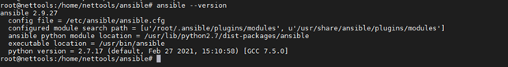

# Installation et mise en place de l'environnement Ansible

Pour l’installation de l’outil Ansible nous aurons un seul prérequis qui est l’installation de pip (Python package manager) si on souhaite le faire dans un environnement virtuel (Docker) sinon il n’y a pas besoin de pip.

On fait d’abord la mise à jour des paquets avec la commande :

```
apt-get update

```
Puis on procède à l'installation de Ansible avec la commande :

```
apt-get install ansible

```

Nous allons maintenant vérifier la version de Ansible installée et localiser l'emplacement des fichiers avec la commande :

```
ansible --version

```


Nous allons enfin créer un dossier de travail « ansible » 

```
mkdir /home/user/ansible

```

Et voilà !!! c'est simple comme bonjour  


## Modification du fichier de configuration

Avec la commande « ansible --version » nous avons pu localiser l'emplacement du fichier de configuration. Nous allons maintenant l'ouvrir avec la commande :

```
nano /etc/ansible/ansible.cfg

```

Dans le segment [defaults], nous allons décommenter la ligne forks et modifier la valeur par défaut du nombre de processus enfants qui sont lancés en simultanés. La valeur par défaut est 5 et nous allons le mettre à 3 afin d'éviter des erreurs de type : **cannot allocate memory**

```
[defaults]

# some basic default values...

#inventory      = /etc/ansible/hosts
#library        = /usr/share/my_modules/
#module_utils   = /usr/share/my_module_utils/
#remote_tmp     = ~/.ansible/tmp
#local_tmp      = ~/.ansible/tmp
#plugin_filters_cfg = /etc/ansible/plugin_filters.yml
forks          = 3
#poll_interval  = 15
#sudo_user      = root
#ask_sudo_pass = True
#ask_pass      = True
#transport      = paramiko
#remote_port    = 22
#module_lang    = C
#module_set_locale = False

```

Toujours dans ce segment nous allons désactiver la vérification de la clé SSH lors de l'établissement de la connexion sur nos équipements distants.

```

# uncomment this to disable SSH key host checking
host_key_checking = False

```

Nous allons ensuite désactiver les messages d'alertes pour aller vers l'essentiel lorsqu'on aura des erreurs en sortie standard après l'exécution d'un playbook

```

# to disable these warnings, set the following value to False:
deprecation_warnings = False

```


